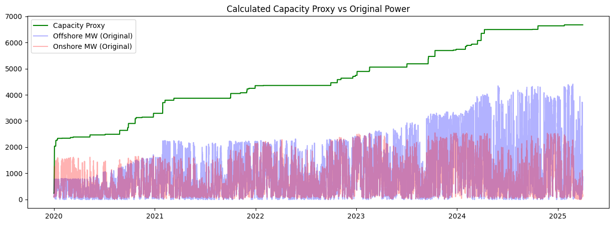
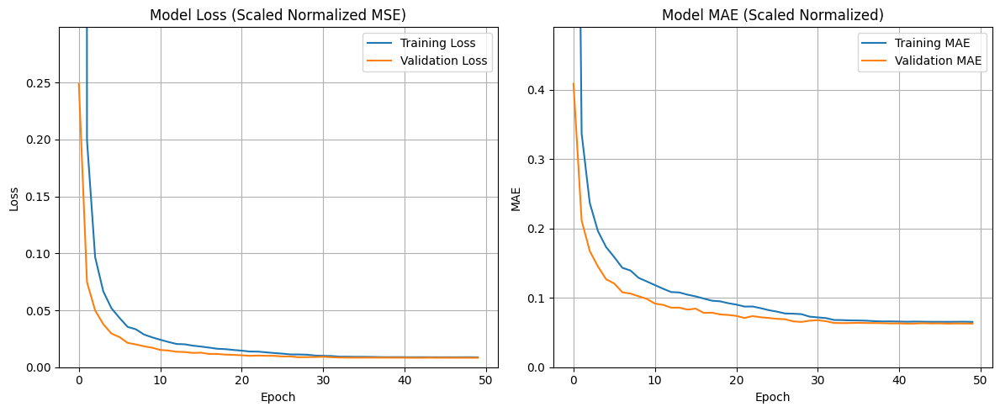
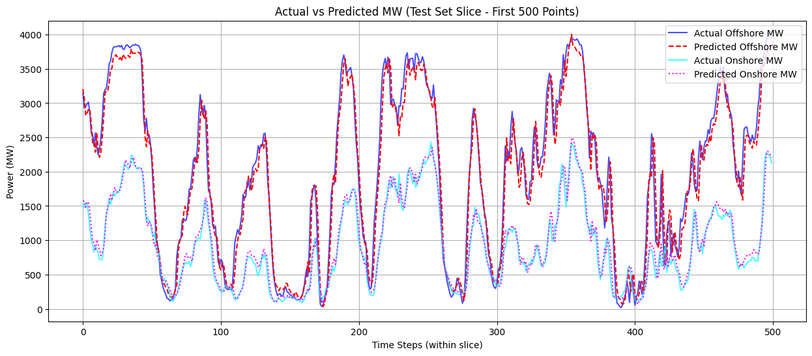
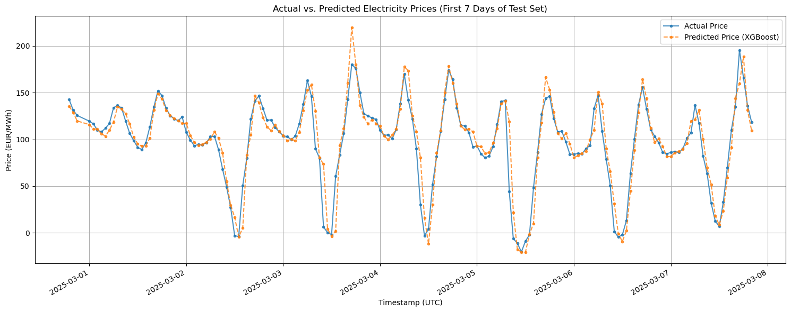

# Tempestas: Wind Energy Production and Price Prediction System

## Project Overview

Tempestas is a two-stage machine learning system designed to predict hourly wind energy production and wholesale electricity prices in the Netherlands. It leverages meteorological data, historical energy generation records, and electricity market pricing to provide accurate forecasts.

## System Architecture

The system operates in two sequential stages:

### Stage 1: Wind Power Prediction

A deep learning model forecasts hourly wind energy generation (both offshore and onshore) based on weather variables and historical production patterns. The model uses weather data from 23 wind turbine clusters across the Netherlands, including wind speed, direction, temperature, pressure, and other meteorological features.

### Stage 2: Electricity Price Prediction

A gradient boosting model uses the predicted wind energy output from Stage 1, along with temporal features and historical price data, to predict hourly wholesale electricity prices.

## Data Sources

The system utilizes data from several publicly available sources:

- **Weather Data**: Open-Meteo Historical Weather API — hourly data from 2017-2025 for 23 wind turbine clusters
- **Energy Production Data**: NED.NL Dataportaal and ENTSO-E Transparency Platform — hourly wind energy production (MW)
- **Electricity Price Data**: Ember Energy Data Repository — hourly wholesale prices (EUR/MWh)

## Results

### Stage 1: Wind Power Prediction

A key challenge in predicting wind power over several years is the significant growth in installed wind capacity. To address this, a capacity proxy was calculated to normalize the predictions relative to available capacity over time.

The following graph shows the calculated capacity proxy (green line) plotted against the original offshore (blue) and onshore (red) wind power generation:



The model training progress shows good convergence without significant overfitting:



Performance on the test set:

| Metric       | Our Model   | Persistence (1H) | Persistence (24H) | Simple Average |
| :----------- | :---------- | :--------------- | :---------------- | :------------- |
| **MAE (MW)** | **110.86**  | 112.54           | 842.01            | 836.85         |
| **RMSE (MW)**| **164.82**  | 177.38           | 1186.74           | 1137.85        |

The model significantly outperforms the 24-hour persistence and simple average baselines, and also beats the 1-hour persistence baseline.

Comparison of actual vs predicted wind power output for the test set:



### Stage 2: Electricity Price Prediction

The price prediction model uses the wind power predictions from Stage 1 along with temporal features and lagged price values to forecast electricity prices.



## Installation

1. Clone the repository:
    ```bash
    git clone https://github.com/gabrielmeleiro1/Tempestas.git
    cd Tempestas
    ```

2. Create a virtual environment and install dependencies:
    ```bash
    python -m venv venv
    source venv/bin/activate
    pip install -r requirements.txt
    ```

## Future Work

- Incorporate solar production for a more holistic renewable energy prediction model
- Extend to neighboring electricity markets with cross-border flow data
- Explore alternative model architectures and ensemble methods
- Develop a pipeline for real-time prediction generation
